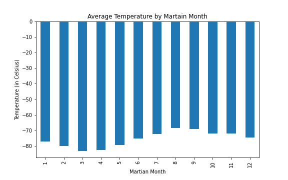
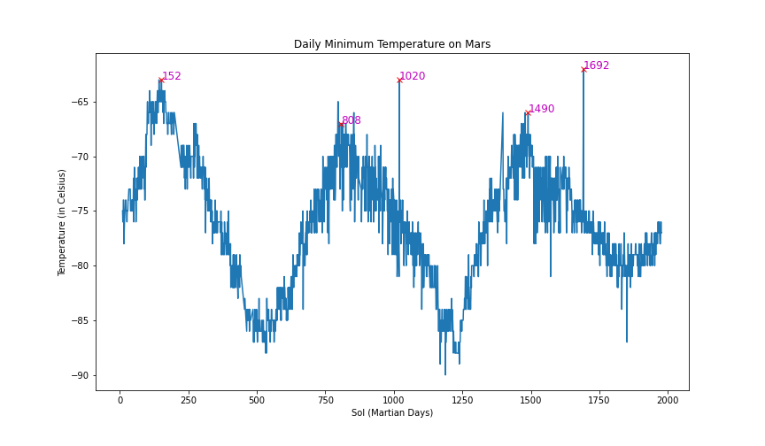

# Mars - Web-Scraping and Data Analysis

This challenge is completed as requirement of Data Analytics Boot Camp at University of Toronto.

This is a web-scraping and data analysis assignment. The assignment involves identifying HTML elements on page, identifying their *id* and *class* attributes, and using this knowledge to extract information via both automated browsing with Splinter and HTML parsing with Beautiful Soup. The assignment is based on scraping different types of information including HTML tables and multiple news articles on a webpage.

This assignment consists of two technical products which comprise of two separate deliverables. These are discussed in the following sections.

## Deliverable 1: Scrape titles and preview text from Mars news articles

This section involves scraping the [Mars News Website](https://static.bc-edx.com/data/web/mars_news/index.html) as shown in the Jupyter notebook named *part_1_mars_news.ipynb* by performing the following steps:

1. Use automated browsing to visit the [Mars News Website](https://static.bc-edx.com/data/web/mars_news/index.html) and then inspect the page to identify which elements to scrape.

2. Create a Beautiful Soup object and use it to extract text elements from the website.

3. Extract the titles and preview text of the news articles that were scraped in text elements. Store each title-and-preview pair in a Python dictionary and, give each dictionary two keys: title and preview, and then store all the dictionaries in a Python list. 

4. Store the scraped data in a JSON file named *news_data.json* which is stored in the Output folder.

## Deliverable 2: Scrape and analyze Mars weather data, which exists in a table

This section involves scraping the [Mars Temperature Data Website](https://static.bc-edx.com/data/web/mars_facts/temperature.html) as shown in the Jupyter notebook named *part_2_mars_weather.ipynb* by performing the following steps:

1. Use automated browsing to visit the [Mars Temperature Data Website](https://static.bc-edx.com/data/web/mars_facts/temperature.html) and then inspect the page to identify which elements to scrape.

2. Create a Beautiful Soup object and use it to scrape the data in the HTML table.

3. Assemble the scraped data into a Pandas DataFrame. The columns have the same headings as the table on the website. This is achieved by scraping and storing header rows separately than the rest of the rows data in the table.

4. Examine the data types that are currently associated with each column and then converting the data to the appropriate datetime, int, or float data types.

5. Analyze the dataset by using Pandas functions to answer the following questions:

### *How many months exist on Mars?*

There are 12 months on Mars.

### *How many Martian days' worth of data are there?*

There is 1867 Martian days' worth of data in this dataset.

### *What is the average low temperature by month?*
### *What are the coldest and the warmest months on Mars (at the location of Curiosity)?*

The following chart is created to display the average low temperatures by months.

Month 3 is the coldest month on Mars with an average temperature of -83.31 Celsius.

Month 8 is the hottest month on Mars with an average temperature of -68.38 Celsius.

On average, the third month has the coldest minimum temperature on Mars, and the eighth month is the warmest. But it is always very cold there in human terms!

### *What is the average pressure by Martian month?*
### *Which months have the lowest and the highest atmospheric pressure on Mars?*

The following chart is created to display the average atmospheric pressure by months.

Month 6 has the lowest atmospheric pressure on Mars which is 745.05.

Month 9 has the highest atmospheric pressure on Mars which is 913.31

Atmospheric pressure is, on average, lowest in the sixth month and highest in the ninth.

### *How many terrestrial (earth) days are there in a Martian year?*

This question is answered by taking into consideration the number of days elapsed on Earth in the time that Mars circles the Sun once.

The result is visually estimated by plotting the daily minimum temperatures against Sol (Martian days). The following chart is created to display the results and identify peaks:

The distance from peak to peak is roughly 1490-808, or 682 days. A year on Mars appears to be about 682 terrestial/ earth days from the plot. Internet search confirms that a Mars year is equivalent to 687 earth days. This means that our visual estimate is within 25% of the actual number.

6. The last step includes exporting the DataFrame to a CSV file named *mars_weather_data.csv* which is stored in the Output folder.